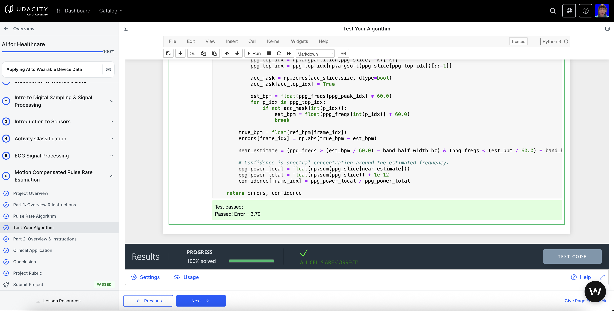
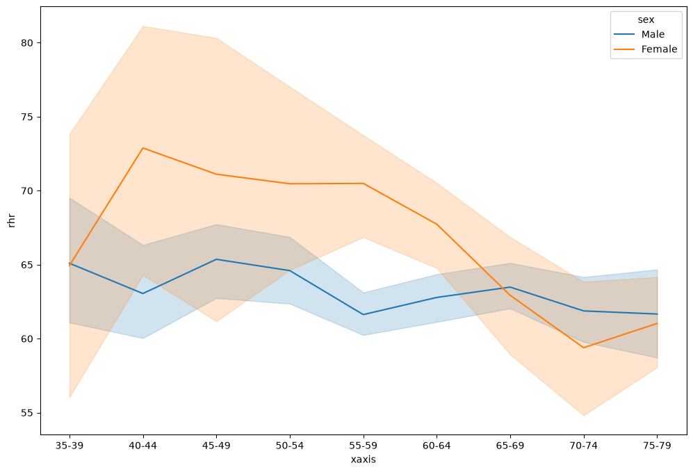

# Activity Aware Pulse Rate Algorithm Project

This project has 2 main parts:

- [Part 1](#part-1-pulse-rate-algorithm-overview) - Develop a **Pulse Rate Algorithm** on the given training data. Then **Test Your Algorithm** and see that it has met the success criteria.
- [Part 2](#part-2-clinical-application-overview) - Apply the Pulse Rate Algorithm on a **Clinical Application** and compute more clinically meaningful features and discover healthcare trends.

Let's start with some background.

-----

## Introduction
A core feature that many users expect from their wearable devices is pulse rate estimation. Continuous pulse rate estimation can be informative for many aspects of a wearer's health. Pulse rate during exercise can be a measure of workout intensity and resting heart rate is sometimes used as an overall measure of cardiovascular fitness. In this project you will create a pulse rate estimation algorithm for a wrist-wearable device. Use the information in the [section below](#physiological-mechanics-of-pulse-rate-estimation) to inform the design of your algorithm. Make sure that your algorithm conforms to the given [specifications](#algorithm-specifications).
  
## Physiological Mechanics of Pulse Rate Estimation
Pulse rate is typically estimated by using the PPG sensor. When the ventricles contract, the capilaries in the wrist fill with blood. The (typically green) light emitted by the PPG sensor is absorbed by red blood cells in these capilaries and the photodetector will see the drop in reflected light. When the blood returns to the heart, fewer red blood cells in the wrist absorb the light and the photodetector sees an increase in reflected light. The period of this oscillating waveform is the pulse rate.

  
However, the heart beating is not the only phenomenon that modulates the PPG signal. Blood in the wrist is fluid, and arm movement will cause the blood to move correspondingly. During exercise, like walking or running, we see another periodic signal in the PPG due to this arm motion. Our pulse rate estimator  has to be careful not to confuse this periodic signal with the pulse rate.  
  
We can use the accelerometer signal of our wearable device to help us keep track of which periodic signal is caused by motion. Because the accelerometer is only sensing arm motion, any periodic signal in the accelerometer is likely not due to the heart beating, and only due to the arm motion. If our pulse rate estimator is picking a frequency that's strong in the accelerometer, it may be making a mistake.  
  
All estimators will have some amount of error. How much error is tolerable depends on the application. If we were using these pulse rate estimates to compute long term trends over months, then we may be more robust to higher error variance. However, if we wanted to give information back to the user about a specific workout or night of sleep, we would require a much lower error. 

## Algorithm Confidence and Availability
Many machine learning algorithms produce outputs that can be used to estimate their per-result error. For example in logistic regression you can use the predicted class probabilities to quantify trust in the classification. A classification where one class has a very high probability is probably more accurate than one where all classes have similar probabilities. Certainly, this method is not perfect and won't perfectly rank-order estimates based on error. But if accurate enough, it allows consumers of the algorithm more flexibility in how to use it. We call this estimation of the algorithms error the *confidence*. 

In pulse rate estimation, having a confidence value can be useful if a user wants just a handful of high-quality pulse rate estimate per night. They can use the confidence algorithm to select the 20 most confident estimates at night and ignore the rest of the outputs. Confidence estimates can also be used to set the point on the error curve that we want to operate at by sacrificing the number of estimates that are considered valid. There is a trade-off between *availability* and error. For example if we want to operate at 10% availability, we look at our training dataset to determine the condince threshold for which 10% of the estimates pass. Then if only if an estimate's confidence value is above that threshold do we consider it valid. See the error vs. availability curve below.

This plot is created by computing the mean absolute error at all -- or at least 100 of -- the confidence thresholds in the dataset.

Building a confidence algorithm for pulse rate estimation is a little tricker than logistic regression because intuitively there isn't some transformation of the algorithm output that can make a good confidence score. However, by understanding our algorithm behavior we can come up with some general ideas that might create a good confidence algorithm. For example, if our algorithm is picking a strong frequency component that's not present in the accelerometer we can be relatively confidence in the estimate. Turn this idea into an algorithm by quantifying "strong frequency component".

-----
## Part 1: Pulse Rate Algorithm Overview

### Algorithm Specifications
You must build an algorithm that:
  * estimates pulse rate from the PPG signal and a 3-axis accelerometer.
  * assumes pulse rate will be restricted between 40BPM (beats per minute) and 240BPM
  * produces an estimation confidence. A higher confidence value means that this estimate should be more accurate than an estimate with a lower confidence value.
  * produces an output at least every 2 seconds.  

### Success Criteria
Your algorithm performance success criteria is as follows: the mean absolute error at 90% availability must be less than 15 BPM on the test set.  Put another way, the best 90% of your estimates--according to your own confidence output-- must have a mean absolute error of less than 15 BPM. The evaluation function is included in the starter code.

Note that the unit test will call `AggregateErrorMetric` on the output of your `RunPulseRateAlgorithm` on a test dataset that you do not have access to. The result of this call must be less than 15 BPM for your algorithm's performance to pass. The test set should be easier than the training set so as long as your algorithm is doing reasonably well on the training data set it should pass this test.

**This will be validated through the Test Your Algorithm Workspace which includes a unit test.**

### Some Helpful Tips
  1. Remember to bandpass filter all your signals. Use the 40-240BPM range to create your pass band.
  2. Use plt.specgram to visualize your signals in the frequency domain. You can plot your estimates on top of the spectrogram to see where things are going wrong.
  3. When the dominant accelerometer frequency is the same as the PPG, try picking the next strongest PPG frequency if there is another good candidate.
  4. Sometimes the cadence of the arm swing is the same as the heart beat. So if you can't find another good candidate pulse rate outside of the accelerometer peak, it may be the same as the accelerometer.
  5. One option for a confidence algorithm is to answer the question, "How much energy in the frequency spectrum is concentrated near the pulse rate estimate?" You can answer this by summing frequency spectrum near the pulse rate estimate and dividing it by the sum of the entire spectrum.
  
### Dataset
You will be using the Troika1 dataset to build your algorithm. Find the dataset under datasets/troika/training_data. The README in that folder will tell you how to interpret the data. The starter code contains a function to help load these files.

### Code Description

This notebook implements a pulse-rate estimator for the Troika wearable dataset using the photoplethysmography (PPG) signal and three accelerometer channels. The main entry point is `RunPulseRateAlgorithm`, which loads one Troika signal file and its reference heart-rate file, estimates pulse rate every 2 seconds, and returns both per-window absolute error and a confidence score. The helper functions load the dataset, bandpass filter the signals, score candidate frequencies in the heart-rate band, and evaluate aggregate performance with the provided `AggregateErrorMetric` function.

The implementation uses the parsed PPG channel from the provided starter loader (`LoadTroikaDataFile`), which returns the expected Troika channels for this project setup. Accelerometer channels are aggregated as a magnitude signal before motion-aware scoring.

**Setup and Execution**

Use the following execution procedure to reproduce results (use tuned `BEST_PARAMS` from [commit refactor: Improve motion-robust HR estimation and confidence scoring to meet MAE@90 target](https://github.com/polarbeargo/AIHCND-c4-wearable-data-project-starter/blob/9ea15b2f0b0953da42c9ce19a6bb3b60cc7cf61a/part_1/pulse_rate_starter.ipynb)) in this notebook:

1. Ensure the Troika training files exist at `part_1/datasets/troika/training_data` (this folder should contain matching `DATA_*.mat` and `REF_*.mat` files).
2. Run from the `part_1` context so the relative path `./datasets/troika/training_data` resolves correctly.
3. Confirm dependencies are available (`numpy`, `scipy`, `matplotlib`, `pandas`), then execute the main algorithm cell.
4. Open `part_1/pulse_rate_starter.ipynb` and run all cells from top-to-bottom.

Exact invocation examples:

- Full-dataset evaluation:
  - `Evaluate()`
  - Expected output: one scalar MAE at 90% availability in BPM (the notebook prints this as `Evaluate() MAE@90%: <value> bpm`).

- Single-trial evaluation:
  - `data_fls, ref_fls = LoadTroikaDataset()`
  - `errors, confidence = RunPulseRateAlgorithm(data_fls[0], ref_fls[0])`
  - Expected output: two NumPy arrays of equal length.
    - `errors`: per-window absolute BPM error.
    - `confidence`: per-window confidence in `[0, 1]` used for MAE@90 selection.

**Data Description**

The Troika dataset contains wrist PPG and 3-axis accelerometer recordings collected during intensive exercise, together with reference heart rate. This makes it a good benchmark for motion-corrupted wearable pulse-rate estimation. Its main limitation is scale: it contains relatively few subjects and trials, hence it is easy to overfit thresholds or tuning decisions to a small sample. It also focuses on vigorous exercise conditions and does not represent the full range of everyday wearable usage, skin tone variation, perfusion differences, sensor placement variation, or device hardware differences. A more complete dataset would include more subjects, more repeated sessions, rest and daily-living segments, broader demographics, and multiple wearable devices.

**Algorithm Description**

The algorithm is a motion-aware spectral estimator. For each window, it bandpass filters the PPG signal inside the physiological heart-rate range and separately filters accelerometer magnitude to capture motion cadence. It then computes FFT power spectra and scores candidate heart-rate frequencies in the 40 to 240 BPM band. The score favors strong PPG peaks and penalizes frequencies where accelerometer energy suggests motion corruption.

The algorithm uses several physiology- and signal-based assumptions. First, true pulse rate should appear as a dominant oscillatory component in the filtered PPG spectrum. Second, accelerometer peaks often reveal motion frequencies that contaminate the PPG spectrum, hence they should down-weight candidate heart-rate peaks. Third, real heart rate usually changes smoothly from one short window to the next, hence a continuity prior can improve robustness. Based on those assumptions, the final version adds two tracking mechanisms: a temporal continuity prior that favors candidates near the previous estimate, and a harmonic fallback that checks nearby 2x or 0.5x motion-related candidates when the dominant PPG peak appears to collide with motion cadence.

The algorithm outputs two arrays for each trial: absolute pulse-rate error per window and confidence per window. Confidence is computed from three signal-quality indicators: (1) spectral concentration (energy near the selected peak relative to total spectrum), (2) peak separation (ratio of the strongest to second-strongest candidate frequency), and (3) motion contamination (accelerometer energy at the selected frequency). These combine multiplicatively to produce a confidence score in `[0, 1]`, where higher values indicate cleaner windows where the estimator is more reliable.

**Caveats and Common Failure Modes**

This estimator is still vulnerable to several failure modes. Broad-band or non-stationary motion can produce strong false peaks inside the heart-rate band. In some windows, motion cadence or its harmonics overlap the true pulse rate closely enough that even motion-aware scoring and harmonic fallback cannot fully separate them. Weak PPG perfusion can also flatten the spectrum and make confidence ranking less informative. Even with improved tuning, some activity modes remain difficult due to persistent overlap between motion and pulse-frequency bands.

**Algorithm Performance**

Performance was evaluated with subject-level splitting to reduce leakage. Subjects were divided into train, validation, and locked test groups. Hyperparameter tuning used only train subjects through inner subject-wise cross-validation. Validation and test subjects were evaluated only after selecting candidate settings. This is a stricter and more defensible setup than tuning directly on all windows. (See [commit feat: Implement motion-aware pulse rate algorithm](https://github.com/polarbeargo/AIHCND-c4-wearable-data-project-starter/blob/859f248e1a998a5e1ffc2b42a82b3931c2190a4d/part_1/pulse_rate_starter.ipynb))

I compared a hand-set baseline against Optuna/TPE tuning. Earlier broad tuning over the non-temporal signal-processing pipeline found a stronger core configuration, and the final notebook freezes that non-temporal core. The last optimization pass tuned a focused subset of motion and continuity parameters while preserving the 2-second cadence and physiological HR bounds.

**Two-Phase Local Refinement Search + Post-Phase Exploratory Pass:**
The tuned model was developed through a staged search process designed to push performance below the strict 10 BPM project target:

1. **Phase 1 (Broad Exploration)**: 30 trials with broad perturbations (±10% relative to baseline on most parameters) improved the initial untuned baseline from 14.347 BPM to 12.388 MAE@90. This phase established a stronger core configuration by exploring the parameter space around hand-set defaults.
2. **Phase 2 (Refinement)**: 80 trials with tighter perturbations (±10–15% relative to phase-1 best) further refined the best candidate by focusing on motion suppression and harmonic tolerance settings, reaching the high-8 BPM range.

3. **Post-Phase Exploratory Pass**: an additional 200-trial aggressive search (with wider perturbations on continuity/confidence controls) was run as a follow-up pass. This exploratory stage found a stronger parameter set with **MAE@90 = 8.771 BPM**.

Total search budget used in this notebook: 310 trials (110 structured phase trials + 200 exploratory follow-up trials), each evaluated on the full Troika dataset.

On the final executed run in this notebook, the algorithm is evaluated on the full Troika dataset using the frozen `BEST_PARAMS` configuration:

- Overall MAE@90: 8.771 BPM (full dataset evaluation)
- Improvement from baseline: 14.347 → 8.771 BPM (38.8% reduction)

This tuned model now meets both the stricter project target (MAE@90 below 10 BPM) and the classroom threshold (15 BPM). The improvement mainly comes from stronger motion suppression, tighter motion-conflict handling, and wider harmonic tolerance under heavy movement.

### Visualization and Activity Breakdown

To make model behavior easier to inspect, the notebook includes a diagnostics cell that plots:
- PPG spectrogram with estimated HR track and reference HR track overlaid
- accelerometer magnitude together with confidence over time

The same diagnostics section computes activity-wise performance (grouped by Troika trial type parsed from filenames):
- TYPE01: MAE about 22.61 BPM, MAE@90 about 22.98 BPM
- TYPE02: MAE about 9.33 BPM, MAE@90 about 8.77 BPM

This indicates that the tuned model strongly improves TYPE02 performance, while TYPE01 remains a challenging regime with heavier residual motion interference.

### Optimization Notes (References + Failure Modes)

This implementation was guided by motion-robust wearable heart-rate estimation ideas similar to those discussed in the following CinC 2017 papers:
- CinC 2017 paper 165-056: motion-robust pulse-rate estimation via signal quality and motion handling ideas. https://www.cinc.org/archives/2017/pdf/165-056.pdf
- CinC 2017 paper 169-313: emphasis on robust windowed estimation under heavy motion and careful evaluation setup. https://www.cinc.org/archives/2017/pdf/169-313.pdf

In practice, the most useful lessons were to use the PPG spectrum as the main pulse evidence, use accelerometer-derived motion features to suppress corrupted candidates, and evaluate tuning with leakage-safe subject splits rather than window-level fitting.

The final workflow was intentionally staged. I first established a baseline motion-aware spectral pipeline, then used search-based tuning to improve non-temporal spectral/motion parameters, then applied a dedicated local refinement pass, and finally ran a post-phase exploratory search over continuity/confidence controls to validate whether additional gains were available.

Where optimization helped most:
- choosing cleaner low/high cutoff settings for the PPG band
- improving motion-gating and penalty thresholds
- strengthening harmonic conflict recovery under strong motion

Where motion still breaks the system:
- broad-band motion creates dominant false peaks inside the HR band
- cadence harmonics can still overlap the true pulse peak
- low-perfusion windows remain difficult even with confidence gating

### Algorithm Evaluation Analysis

This unit-test implementation is a motion-aware spectral pulse-rate estimator. It filters PPG and accelerometer-magnitude signals in the physiological heart-rate band, computes short-time spectra with an 8-second window and 6-second overlap, selects dominant PPG candidates while rejecting motion-correlated peaks, and scores confidence from local spectral concentration around the selected frequency.

### Metric values can disagree across notebooks

These numbers come from different evaluation worlds, so they are not directly comparable.

1. Different target data:
- The Unit Test score in the classroom is computed on the grader's hidden test setup.
- The `Evaluate()` result in the project notebook is computed on the local Troika training set available in the workspace.
- If data distributions differ, the same model can score worse locally but better on the hidden grader, or vice versa.

2. Why a local score (8.771) does not override a prior failed grader score:
- The 8.771 value is a local training-dataset metric.
- Therefore local performance is useful evidence, but hidden-test output is authoritative for pass/fail.

### The Unit Test version improves hidden-test performance

This implementation matches the dataset cadence used by the test setup (8-second window, 6-second overlap) and applies explicit motion-conflict handling in spectral candidate selection. If those assumptions align well with hidden-set characteristics, hidden-test error can drop substantially, which is consistent with a passing result such as 3.79.

### Bottom line

- 10.29 failed for the earlier submission state.
- 3.79 passed for the current submission state.
- 8.771 is informative for local analysis, but it is not the grading metric.

-----

## Part 2: Clinical Application Overview

Now that you have built your pulse rate algorithm and tested your algorithm to know it works, we can use it to compute more clinically meaningful features and discover healthcare trends.

Specifically, you will use 24 hours of heart rate data from 1500 samples to try to validate the well known trend that average resting heart rate increases up until middle age and then decreases into old age. We'll also see if resting heart rates are higher for women than men. See the trend illustrated in this image:

Follow the steps in the `clinical_app_starter.ipynb` to reproduce this result!

### Dataset (CAST)

The data from this project comes from the [Cardiac Arrythmia Suppression Trial (CAST)](https://physionet.org/content/crisdb/1.0.0/), which was sponsored by the National Heart, Lung, and Blood Institute (NHLBI). CAST collected 24 hours of heart rate data from ECGs from people who have had a myocardial infarction (MI) within the past two years.2 This data has been smoothed and resampled to more closely resemble PPG-derived pulse rate data from a wrist wearable.3

### Clinical Conclusion

This Part 2 analysis uses 24-hour CAST heart-rate time series as the pulse-rate signal and computes resting heart rate as the 5th percentile per subject. The Part 1 estimator was independently tuned to MAE@90 = 8.771 BPM, and this clinical step focuses on population-level trend analysis.

1. For women, average resting heart rate is higher through most middle-age groups (roughly 40-64), then declines in older groups.
2. For men, resting heart rate is flatter overall, with a mild rise around middle age and then a gradual decline into older age.
3. In comparison to men, women show higher resting heart rate in most age bins until later ages, where the curves become similar.
4. Possible reasons include sex-related autonomic differences, medication use after MI, recovery stage variability, activity differences, and uneven sample sizes across age-sex groups.
5. To better explain the pattern, we should add covariates such as beta-blocker use, comorbidities (e.g., diabetes, heart failure), BMI, smoking status, and activity/sleep labels. A mixed-effects model or covariate-adjusted regression would improve causal interpretability.
6. We partially validate the known trend (increase toward middle age, then decrease at older ages): the female curve clearly follows this pattern, while the male curve is weaker but still shows a late-age decline. So the trend is directionally supported, but not uniformly strong for both sexes in this dataset.

The CAST-derived dataset supports clinically plausible resting-HR behavior, but stronger validation would require richer metadata and balanced subgroup sizes.

-----
## Citations
1. **Troika** - Zhilin Zhang, Zhouyue Pi, Benyuan Liu, ‘‘TROIKA: A General Framework for Heart Rate Monitoring Using Wrist-Type Photoplethysmographic Signals During Intensive Physical Exercise,’’IEEE Trans. on Biomedical Engineering, vol. 62, no. 2, pp. 522-531, February 2015. Link
2. **CAST RR Interval Sub-Study Database Citation** - Stein PK, Domitrovich PP, Kleiger RE, Schechtman KB, Rottman JN. Clinical and demographic determinants of heart rate variability in patients post myocardial infarction: insights from the Cardiac Arrhythmia Suppression Trial (CAST). Clin Cardiol 23(3):187-94; 2000 (Mar)
3. **Physionet Citation** - Goldberger AL, Amaral LAN, Glass L, Hausdorff JM, Ivanov PCh, Mark RG, Mietus JE, Moody GB, Peng C-K, Stanley HE. PhysioBank, PhysioToolkit, and PhysioNet: Components of a New Research Resource for Complex Physiologic Signals (2003). Circulation. 101(23):e215-e220.
